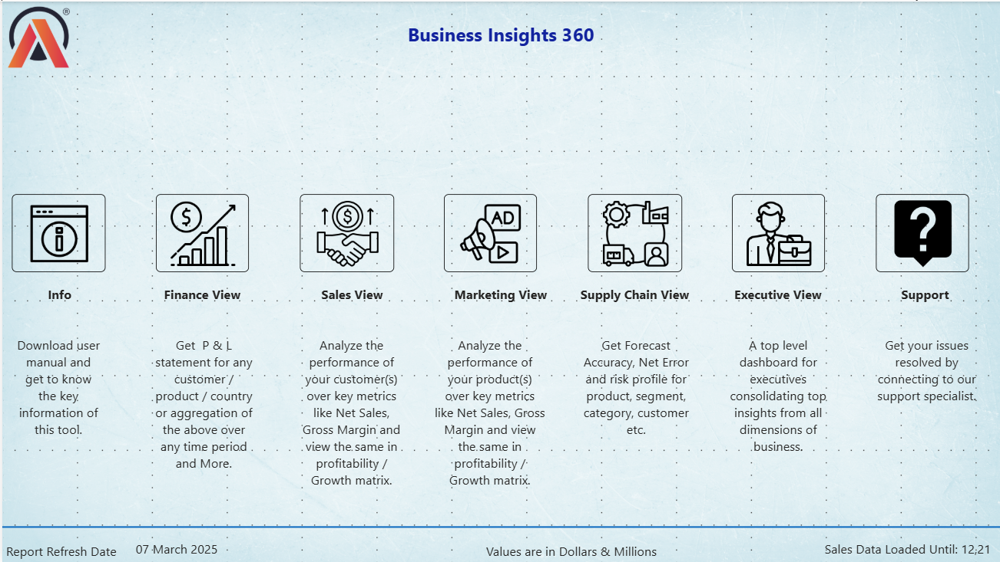
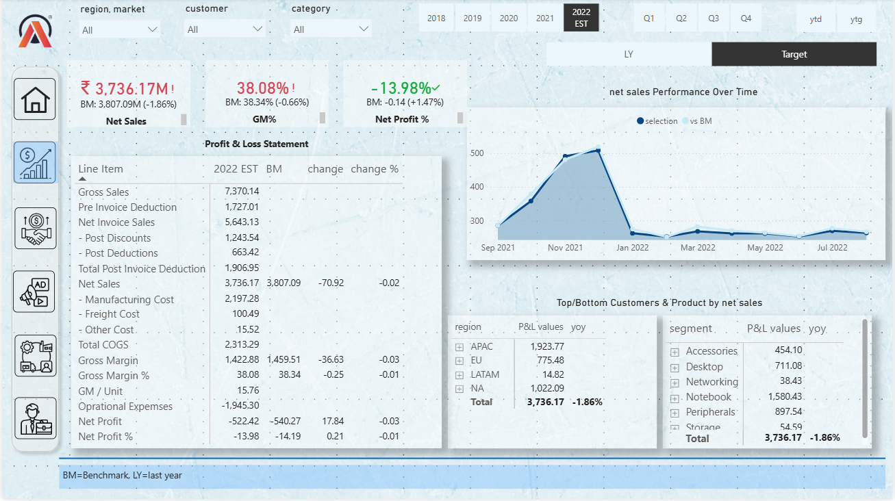
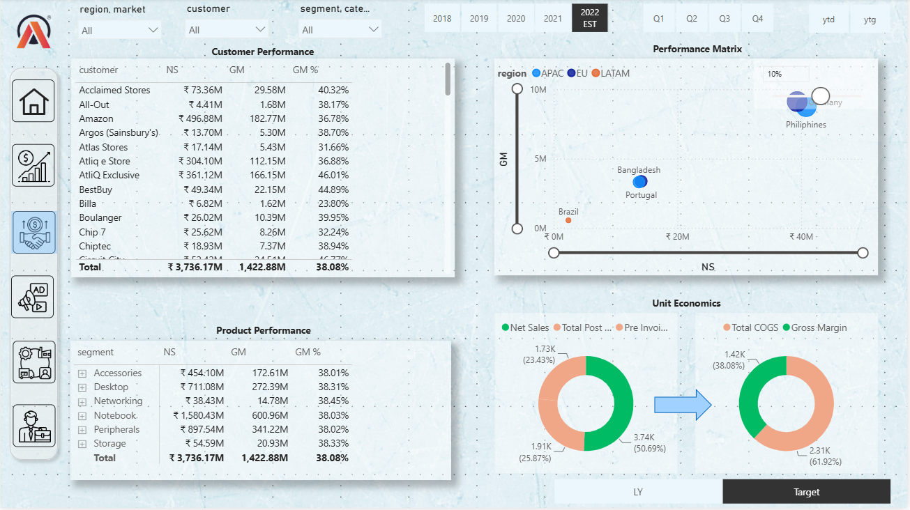
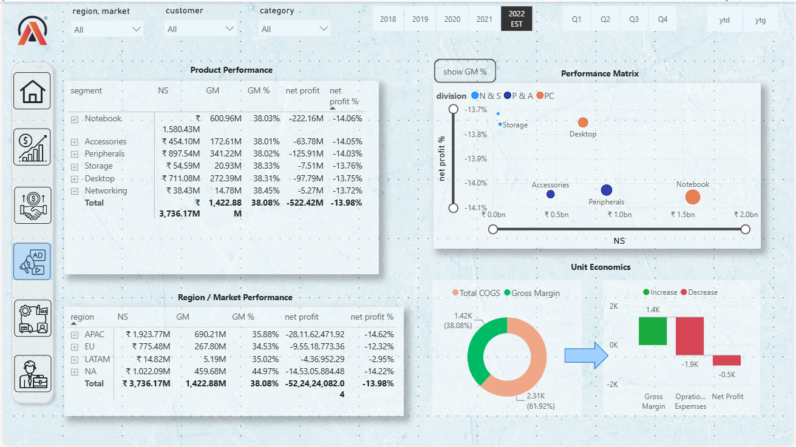
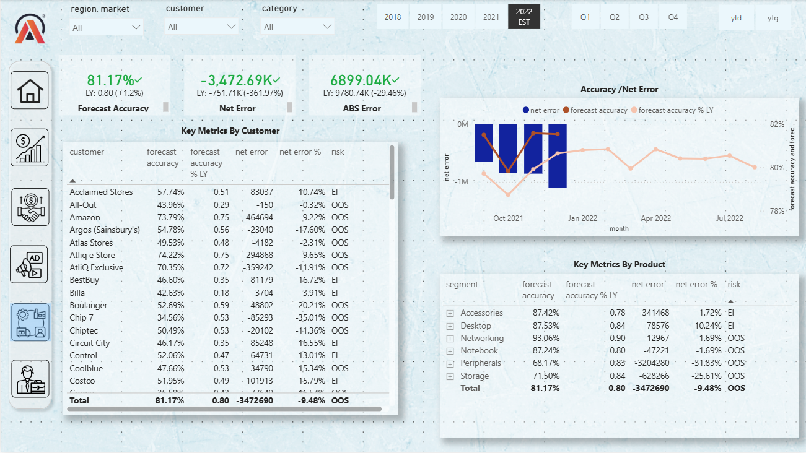
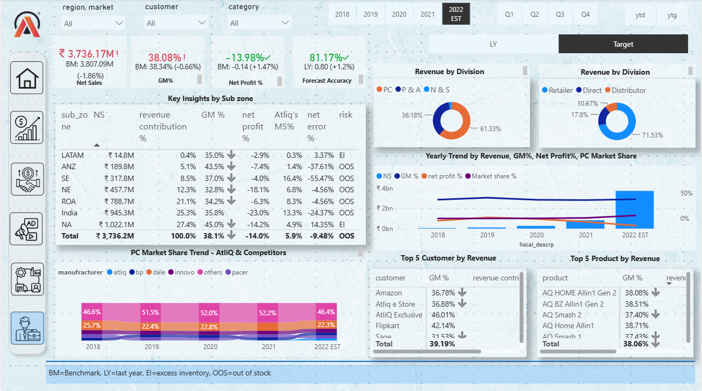

# Business Insights 360 – Power BI Dashboard

An interactive Power BI dashboard developed to analyze business performance across Finance, Sales, Marketing, Supply Chain, and Executive functions.

## Project Overview

Business Insights 360 provides a consolidated view of key business metrics and helps analyze business performance across customers, products, regions, markets, and time periods.

The dashboard was developed using Power BI, SQL, Excel, DAX, and Power Query to transform data, create KPIs, and build interactive reports for business analysis.

## Dashboard Views

### Finance View

Analyzes financial performance through:

- Net Sales
- Gross Margin
- Gross Margin %
- Profit & Loss analysis
- Business performance trends
- Regional and market-level analysis

### Sales View

Provides insights into:

- Customer performance
- Product performance
- Net Sales
- Gross Margin
- Gross Margin %
- Customer and product trends

### Marketing View

Analyzes:

- Product performance
- Market performance
- Regional performance
- Profitability
- Customer and product insights
- Key business metrics

### Supply Chain View

Analyzes:

- Forecast Accuracy
- Net Error
- Absolute Error
- Customer-level forecast performance
- Product-level forecast performance
- Supply chain performance indicators

### Executive View

Provides a consolidated overview of important business KPIs and performance across different business functions.

## Tools & Technologies

- Microsoft Power BI
- DAX
- Power Query
- MySQL
- Microsoft Excel
- Data Modeling
- Data Visualization

## Key Features

- Interactive dashboards
- KPI cards
- Slicers and filters
- Drill-through navigation
- DAX-based measures
- Data transformation using Power Query
- Profitability analysis
- Customer and product analysis
- Regional and market analysis
- Forecast accuracy analysis
- Executive-level reporting

## Dashboard Screenshots

### Home / Overview

### Finance View

### Sales View

### Marketing View

### Supply Chain View

### Executive View

## Project Highlights

- Connected and transformed data from MySQL and Excel using Power Query.
- Created DAX measures to calculate and monitor business KPIs.
- Developed interactive reports using slicers, filters, KPI cards, and drill-through navigation.
- Analyzed customer, product, regional, and market performance.
- Built financial and profitability analysis views.
- Developed supply chain analysis focused on forecast accuracy and errors.
- Created an executive-level dashboard for consolidated business performance analysis.

## Note

The Power BI `.pbix` file is not included in this repository due to GitHub file-size limitations. Dashboard screenshots are provided to demonstrate the project and its different analytical views.
